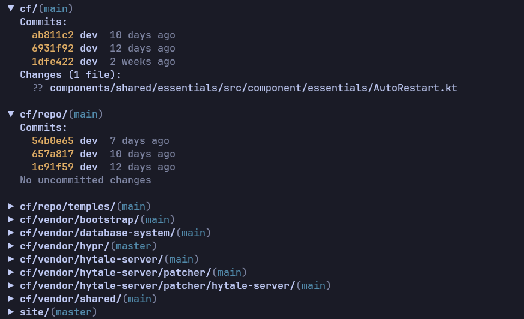

# gitmonitor

A terminal UI for monitoring multiple git repositories at once. Recursively discovers repos, shows branches, recent commits, uncommitted changes, and inline diffs. Auto-refreshes every 5 seconds.



## Install

```bash
bun install
bun link
```

## Usage

```bash
gitmonitor ~/projects
```

Pass a root directory as the argument. Defaults to `.` if omitted.

## Keybindings

| Key | Action |
| --- | --- |
| `j` / `Down` | Move cursor down |
| `k` / `Up` | Move cursor up |
| `l` / `Right` / `Enter` | Expand repo / open detail / view diff |
| `h` / `Left` / `Escape` | Collapse repo / back |
| `Page Up` / `Page Down` | Scroll by page |
| `r` | Refresh |
| `q` / `Ctrl+C` | Quit |

## License

[GPL-3.0](LICENSE)
